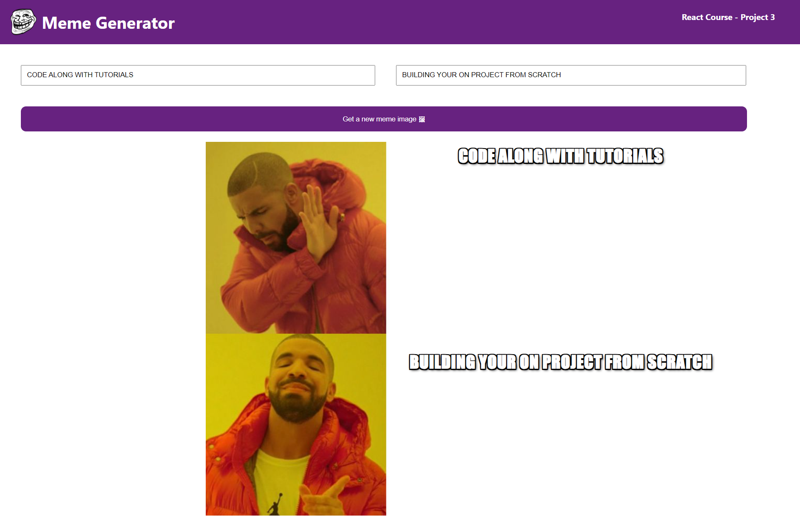

# MEME GENERATOR

The React Meme Generator with Text is a web application built using the React framework that allows users to easily create and customize memes with text captions. With this fun and interactive tool, users can generate hilarious memes by selecting popular meme templates from the API .

# Concepts Learned

1 . Event Listeners 

2 . State

3 . Conditional Rendering

4 . Forms

5 . Side Effects

## Deployment

Netlify :- https://memes-generator-with-text.netlify.app/

## Screenshots

## 🚀 About Me
I'm a full stack developer...

## Authors

- [@piyush932](https://github.com/piyush932)

# Hi, Piyush Kumar Nayak 👋

## 🔗 Links

## 🛠 Skills
Javascript, HTML, CSS, React , Nodejs, Mongodb, C ,C++, Python

